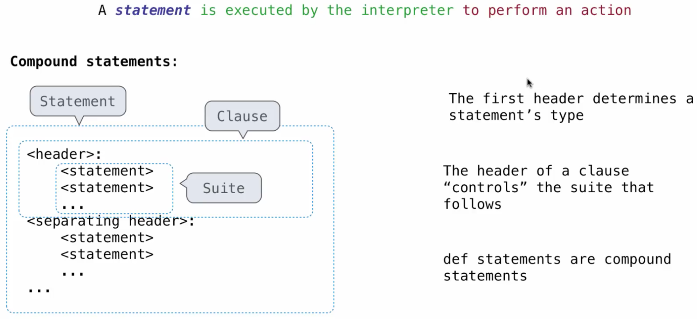
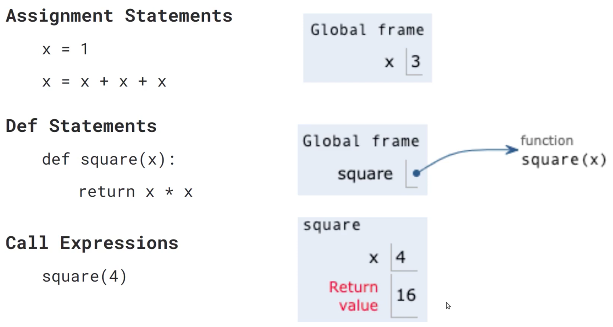
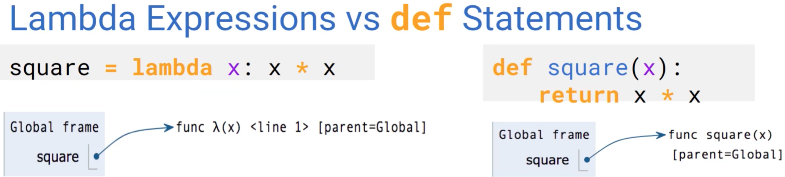
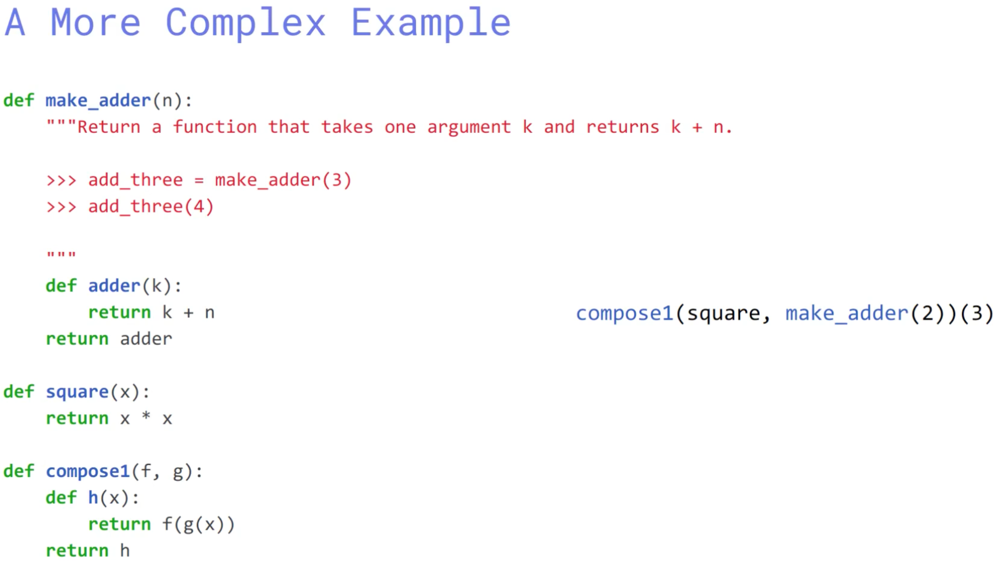

---

title: CS 61A Summer 2019 | Preview

layout: template

filename: CS-61A-Summer-2019-Preview

---

# CS 61A Summer 2019 | Preview

# 0 | Helpful Resources

Python Tutor (visualize code)

Python Anywhere

# 1 | Lecture 1

Chris Allsman, they them

Comp Sci = Problem-solving, optimization

​	e.g. systems, AI, graphics, security, networking, programming, theory, scientific

CS 61A = Managing **complexity** (mastering **abstraction**, programming **paradigms**)

​	Comparative, declarative, functional

Lab = practice

Discussion = think

**Expression** = Representation a computation & evaluates to a value

​	In compsci — `f(x)` describes the output after we apply some operation to some #

​			e.g. `max(2, 4)` in python, where () indicates it is function

​		from operator import add, mul

​			e.g. `add(2, 3)`, where add is the operator and 2 and 3 are operands

​			e.g. `mul(2, 3)`

​	1. Evaluate operator

​	2. Evaluate operands

​	3. Apply the operation

**Nested Call Expression** | Computers can’t evaluate the same way we do!

​	Expression tree = representation of how comp. calculates level by level

Functions

Values

```python
shakes = open(“Shakespeare.txt”)
text = shakes.read().split()
text[:25]
len(text)
text.count(“the”)
text.count(“,”)
words = set(text)
“the” in words
len(words)
{w for w in words if w == w[::-1] and len(w) > 4}
```

`Set()` is an object

# 2 | Lecture 2

Elements of a Program

​	**Expressions** | Primitive (numbers, strings), Arithmetic, Call (Func) 

​	**Values** | Diff. types of data (int, string, float, bool)

​			Declaration or import, e.g. `from math import pi`

Multiple Declarations, e.g. `a, b = 2, 6.2`

Statement: `x = 1 + 3 ** 3 // 2`

​		  name    expression

​	e.g. `f, g, h = min, max, min; max(f (2, g( h(1, 5), 3) ), 4)`

Environment = collection of bindings of names-value pairs

Functions are a type of value

Functions = abstract away entire expressions & sequences of computation 

​	Some series of step applied to arguments → Output (return)

```python
def <name>(<parameters>): # Fuction signature
	return <return expression> # Function body
```

```python
def volume (r) :
	return (4/3) * pi * (r ** 3)
```

```python
def ratioOfVolumes (r1, r2):
	return volume(r1) / volume(r2)
```

`def` statements are a type of assignment, binding names to function values

​	1. Create new **environment frame**

​	2. Evaluate the expressions


Calling / applying user-defined function

1. Add local frame = **new environment** (environment = sequence of frames)

e.g. local frame, followed by global frame

1. **Bind** formal **parameters** to its **arguments**
2. Execute the **body of function**, in new environment

# 3 | Lecture 3

`print`

`None` Functions wo/ return

**Pure functions** | Just return the value, argument → function → return, e.g. power

**Non-pure functions** | Have side effects, displays some value, e.g. print

**Expressions** evaluates to a value

**Statements** specifies an action, e.g. declaration, function

**Control** Make decisions based on value, i.e. if, elif, else

`vim ex.py` creates new file

`python3 ex.py` runs the file

`python3 -i ex.py` runs the file with the interpreter

**Boolean** | `True` or `False` (None, 0, “”)

​	`and`, `or`, `not`



# 4 | Lecture 4

**Environment Diagrams** | Visual illustration of bindings & states



**Parent Frame** = Where a function was defined in 

Environment = collection of frames

```python
def square(x):
  return x ** 2

def sum_of_squares(x, y):
  return square(x) + square(y)

sum_of_squares(3, 4)
```

**Global**

square |__ → `func square(x)` [parent=Global]

sum_of_squares |__ → `func square(x)` [p=G]

**f1 sum_of_squares [p=G]**

​	x |<u>3</u>		RV |<u>25</u>

​	y |<u>4</u>

**f2 square [p=G]**

​	x |<u>3</u>

​	RV |<u>9</u>

**f3 square[p=G]**

x |<u>4</u>

RV |<u>16</u>

**Variable Lookup** Look in current frame, then in parent … until global frame

**Lambda expressions** Evaluate to functions

```python
square = lambda x: x ** 2
s = lambda x: sum(i for i in range(x+1))
```



<u>RV</u> = `None` if function has no return value

# 5 | High-Order Functions

Functions = **first class objects** — can be manipulated like values

**High order function** | Takes in function as input / returns function as output

**Domain** = Set of all possible inputs

**Range** = Set of all possible outputs

**Behavior** = What the function does

Functions = does something well, and do some variation of that task

​	Generalize, if you can

`assert <Bool>`, “Error message” returns error if Bool is False

`python3 -m ex.py` runs th

```python
def make_adder(n):
	def adder(k):
		return k + n
	return adder

>>> add_two = make_adder(2)
>>> add_two(3)
5
```



```python
def print_sums(n):
	print(n)
	def next_sum(k):
		return print_sums(n + k)
	return next_sum

>>> print_sums(1)(2)(3)
1
3
6
<function print_sums.<locals>.next_sum at 0x1083005e0>
```

Iterative (trial & error) = helpful in finding $\sqrt[3]{x}$, e.g. Newton’s Method

Currying

```python
>>> def curried_pow(x):
		def h(y):
			return pow(x, y)
		return h

>>> curried_pow(2)(3)
8
```

`compose1 = lambda f,g: lambda x: f(g(x))`

# 6 | Iteration / Recursion

```python
>>> e = lambda n: lambda x: x ** n # Returns exponent of xn
>>> t = lambda n, f: sum(f(i) for i in range(n+1)) # Total of n terms each transformed by f
>>> t(10, e(1))
55
```

```python
def end(n): # e.g. 12345
	while n>0:
	last, n = n%10, n // 10 # e.g. 5, 1234
	print(last, n)
```

```python
def search(f):
	x = 0
	while not f(x):
		x += 1
	return x

def inverse(f):
  """Return g(y) such that g(f(x)) -> x"""
  return lambda y: search(lambda x: f(x) == y)

square = lambda x: x**2

>>> square(16)
256

>>> sqrt = inverse(square)
>>> sqrt(256)
16
```

```python
>>> def print_all(x):
	print(x)
	return print_all

>>> print_all(1)(3)(5)
1
3
5
<function print_all at 0x104ceeca0>
```

```python
def print_sums(n):
	print(n)
	def next_sum(k):
		return print_sums(n+k)
	return next_sum

>>> print_sums(1)(3)(5)
1
4
9
<function print_sums.<locals>.next_sum at 0x104d03310>
```

Short-circuiting → A form of control

`<left>` and `<right>` stops evaluating at the first false value

`<left>` or `<right>` stops evaluating at the first true value

```python
def reasonable(n):
	return n == 0 or 1/n != 0
```

<consequent> `if` <predicate> `else` <alternative>

```python
from doctest import testmod
>>> testmod()
TestResults(failed=0, attempted=2)

def count_partitions(n, m):
	"""Count the ways to partition n using parts up to m."""
	if n == 0:
		return 1
	elif n < 0:
		return 0
	elif m == 0:
		return 0
	else:
		return count_partitions(n-m, m) + count_partitions(n, m-1)
```


Chapter 1 of the Book finished