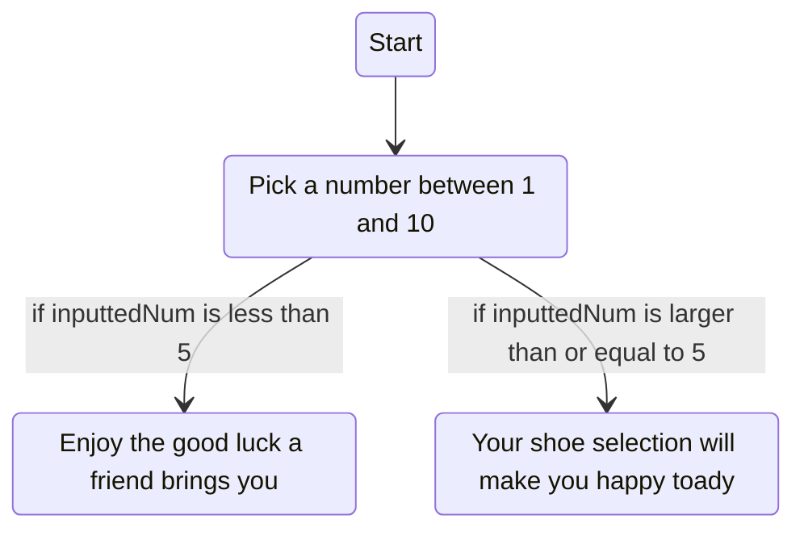
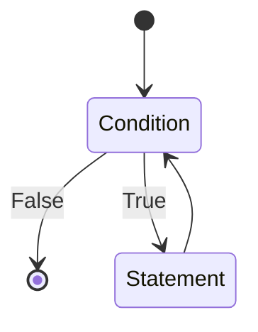

---

title: Java with Hodge

layout: template

filename: Java-with-Hodge

---

# Java with Hodge

[Course Page](https://www.linkedin.com/learning/learning-java-4/)

[Course Repo](https://github.com/LinkedInLearning/learning-java-2825378)

[My Repl.it](https://repl.it/@jacobwub/java-hodge)

Java = popular

- Web
- Mobile
- Desktop
- Other

This class = programming fundamentals

- Loops, functions, classes
- Real world examples
- Debugging

No prior experience necessary

# 1 Getting Started with Java

Programming language –-- vocabulary, grammatical rules
Motivation –-- complete tasks using computers

**Java Runtime Environment (JRE)** = needed to **run** Java programs

**Java Development Kit (JDK)** = needed to **build** & **develop** Java programs

```python
for i in range(10):
	print(i)
```

Command Line = User-interface (replace mouse, GUI)

`ls` **l**i**s**ts files in a directory

`cd` **c**hange **d**irectory

​	`cd ..` goes to parent directory

`mkdir` **m**a**k**e **dir**ectory

Java = verbose programming language

​	Lots of words we have to write

All java code = must be in a **class**

``` java
public class HelloWorld {
  public static void main(String[] args) {
    System.out.println("Hello World!");
  }
}
```

Use `javac HelloWorld.java` to compile

Use `java HelloWorld` to run

Two commands, too troublesome → In comes Integrated Development Environment (IDE)

​	Recommended IDE: [IDEA](https://www.jetbrains.com/idea/)

# 2 Building Strong Foundations

**Data** Information processed by computer

​	e.g. name, age, whether light is on or off

**Data Types** Stores different values

​	Primitive: **Boolean**, **int**, **double** (decimal), **char** (character)

​	Reference: **String** (sequence of ordered characters), 

`charAt` returns the nth char of a string

`+` Concatenates two strings

`Scanner input = new Scanner(System.in);` Gets input from user; first Scanner is data type

​	Requires `import java.util.Scanner;`

```java
import java.util.Scanner;

public class Main {

    public static void main(String[] args) {
        double studentGPA = 3.45;
        String studentFirstName = "Kayla";
        String studentLastName = "Hammon";
        System.out.println(studentFirstName + " " +
                studentLastName + " has a GPA of " + studentGPA);
        System.out.println("What do you want to update it to?");

        Scanner input = new Scanner(System.in);
        studentGPA = input.nextDouble();
      
        System.out.println(studentFirstName + " " +
                studentLastName + " now has an updated GPA of " + studentGPA);
    }
}
```


# 3 Control Flow

Decision-making logic

Using conditions, we can adjust how the program behaves



**Relational Operator**, e.g. >

**Boolean Expression**, e.g. inputtedNum > 5

```java
import java.util.Scanner;

public class Main {

    public static void main(String[] args) {
        System.out.println("Pick a number between 1 and 10");
        Scanner scanner = new Scanner(System.in);

        int inputtedNum = scanner.nextInt();

        if (inputtedNum < 5) {
          System.out.println("Enjoy the good luck a friend brings you");
        } else {
          System.out.println("Your shoe selection will make you happy toady");
        }
    }
}
```

## Scope

**Scope** of a variable = where (in terms of the program) a variable is accessible

​	In scope, or parent, then accessible

​	Otherwise, inaccessible

## Loops

Repeatedly runs code



```java
import java.util.Scanner;

public class Main {

    public static void main(String[] args) {
        Scanner input = new Scanner(System.in);
        boolean isOnRepeat = true;

        while(isOnRepeat) {
          System.out.println("Playing current song");
          System.out.println("Would you like to take this off repeat?");
          String userInput = input.next();

          if(userInput.equals("yes")) {
            isOnRepeat = false;
          }
        }
        System.out.println("Playing next song");
    }
}
```

``` java
import java.util.Scanner;

public class Main {

    public static void main(String args[]) {
        String question = "Am I cool?";
        String choiceOne = "Yes";
        String choiceTwo = "No";
        String choiceThree = "I don't know";

        String correctAnswer = choiceOne;

        System.out.println("You have received a new question: " + question);
        System.out.println("Your choices are:\nA. " + choiceOne + "\nB. " + choiceTwo + "\nC. " + choiceThree);

        System.out.println("So, what do you think?");
        Scanner input = new Scanner(System.in);
        String userResponse = input.nextLine();

        System.out.println("You think " + userResponse);

        if (userResponse.matches("Yes") || userResponse.matches("A")) {
          System.out.println("I think you are absolutely right");
        }

        else {
          System.out.println("I think we have difference of opinions so I say to you, think again!");
        }
    }
}
```

# 4 Debugging in Java

**Debugging** Locating & fixing errors in a program

 * Use `print` statements, alternatively IDE can also help
   	* **Breakpoint** Intentional stop to examine program's internal state
	* Look for **syntax errors** (misspelled or missing elements)
	* **Logical errors** Runs but doesn't provide what we expect

# 5 Functions in Java

**Functions** Series of finite steps to accomplish some task

​	Helps organize code

​	Allows reusing of similar procedures

```java
import java.util.Scanner;

public class Main {
  public static void announceTeaTime() {
    System.out.println("Waiting for developer tea time");
    Scanner input = new Scanner(System.in);
    input.next();

  }

  public static void main(String[] args) {
    announceTeaTime();
    System.out.println("It's now developer tea time!");
  }
}
```

```java
public class Main {

    public static double calculateTotalMealPrice(double listedMealPrice, double tipRate, double taxRate) {
      return listedMealPrice + listedMealPrice * (1+taxRate) + listedMealPrice * (1+tipRate);
    }

    public static void main(String[] args) {
      double groupTotalCost = calculateTotalMealPrice(15, 0.2, 0.1);
      System.out.println("Your group total is: " + groupTotalCost);
      System.out.println("Your individual total is: " + groupTotalCost/5);
    }
}
```

## Functions

**Built-in** functions are accessible, usually using dot operators

​	Basic, well-documented

```java
public class Main {
    public static void main(String[] args) {
        double result = Math.pow(2, 5);
        System.out.println(result);
    }
}
```

~~~java
import java.util.Scanner;

public class Main {
  public static double annualIncome(double hours, double wage, int daysAbsent) {
    return (hours*54 - 8*daysAbsent) * wage;
  }
  
  public static void main(String[] args) {
    System.out.println("How many hours does the employee work per week?");
    Scanner input = new Scanner(System.in);
    double hours = input.nextDouble();

    System.out.println("What is the employee's hourly wage?");
    double wage = input.nextDouble();

    System.out.println("How many days is the employee absent?");
    int daysAbsent = input.nextInt();

    System.out.println(annualIncome(hours, wage, daysAbsent));
  }
}
~~~

# 6 Classes in Java

**Class** = user-defined blueprint

​	Attributes/Properties

​	Behaviors/Methods

**Instance** = Object created from class

​	Instantiated using *Constructor*

​	Use this.<variable name> to indicate attribute variable

```java
public Triangle(double base, double height, double side1, double side2, double side3) {
  this.base = base;
  this.height = height;
  this.side1 = side1;
  this.side2 = side2;
  this.side3 = side3;
}

Triangle triangleA = new Triangle(12, 8, 15, 8, 17)
```

```java
public class Triangle {
    double base;
    double height;
    double sideLenOne;
    double sideLenTwo;
    double sideLenThree;

    public Triangle(double base, double height,
                    double sideLenOne, double sideLenTwo,
                    double sideLenThree) {
        this.base = base;
        this.height = height;
        this.sideLenOne = sideLenOne;
        this.sideLenTwo = sideLenTwo;
        this.sideLenThree = sideLenThree;
    }

    public double findArea() {
        return (this.base * this.height) / 2;
    }
}

public class Main {
  public static void main(String[] args) {
    Triangle triangleA = new Triangle(15,15,15,5,5);
    Triangle triangleB = new Triangle(3,3.2,3,3.7,3.8);

    System.out.println(triangleA.findArea());
  }
}
```

Instance methods = *non-static* (need an instance in order to access, unlike built-in functions like `pow()`)